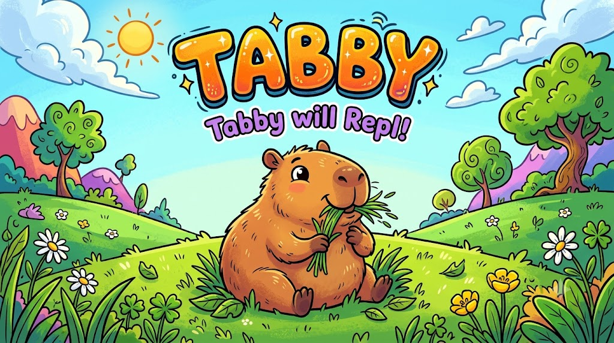

<div align="center">



# Tabby XRM REPL

**A fast, portable JavaScript REPL for Microsoft Dataverse & Dynamics 365**

*Query your org. Automate tasks. Inspect metadata. No browser. No plugins. Just run.*

---

[](https://github.com/devguy2000/TabbyProject-PublicRelease/releases/latest)
&nbsp;
[](https://github.com/devguy2000/TabbyProject-PublicRelease/releases/latest)

</div>

---


## What is Tabby?

Tabby is a standalone desktop REPL (Read–Eval–Print Loop) for **Microsoft Dataverse / Dynamics 365**. It lets you write and run JavaScript directly against your Dataverse org — no browser console hacks, no Postman setup, no XrmToolBox plugin to install.

It is designed for:
- **Dynamics 365 consultants** who need to query or update records quickly
- **Developers** debugging plugins, workflows, and Web API responses
- **Power Platform admins** who want to inspect metadata, audit logs, security roles, and org settings without clicking through the UI

---

## Download & Run

> **No installation required.** Just download and double-click.

1. Go to the **[Releases](https://github.com/devguy2000/TabbyProject-PublicRelease/releases/latest)** page
2. Download **`Tabby.x.x.x.exe`**
3. Double-click to run

> **Windows SmartScreen warning?**  
> Click **More info → Run anyway**. This is normal for unsigned portable apps.

---

## Features

### Direct Dataverse API access via `$api`

```javascript
// GET — query any OData endpoint
const accounts = await $api.get('accounts?$select=name,telephone1&$top=10');
console.table(accounts.value);

// POST — create a record
await $api.post('contacts', { firstname: 'Jane', lastname: 'Smith' });

// Auto-paginate through all results
const all = await $api.getAll('accounts?$select=name');

// FetchXML
const results = await $api.fetch('accounts', `<fetch><entity name="account"><attribute name="name"/></entity></fetch>`);
```

### Familiar Xrm.WebApi surface

```javascript
// Works just like in a form script
const result = await Xrm.WebApi.createRecord('account', { name: 'Contoso' });
console.log('New ID:', result.id);

const record = await Xrm.WebApi.retrieveRecord('contact', '00000000-...', '?$select=fullname');

const contacts = await Xrm.WebApi.retrieveMultipleRecords('contact', '?$top=25');
console.table(contacts.entities);
```

### Raw HTTP mode — no JavaScript needed

```
GET accounts?$select=name&$top=5

POST contacts
{"firstname":"Jane","lastname":"Doe"}

PATCH accounts(00000000-0000-0000-0000-000000000000)
{"name":"Updated Name"}
```

### Built-in helpers

| Helper | What it does |
|--------|-------------|
| `$whoami()` | Returns your user ID, Business Unit, and full name |
| `$entities()` | Lists all entity definitions (cached per session) |
| `$attributes('account')` | Lists all attributes for an entity |
| `$last` | The return value of your previous run |
| `$` | A persistent store that survives between runs in the same session |

### 30+ starter snippets included

Ready-to-run snippets for the most common tasks — click, fill in a parameter or two, and run:

- Who Am I · Create / Update / Delete / Retrieve records
- Accounts table · Contacts table
- Audit log · Who last changed a record
- Plugin assemblies · Plugin steps · Plugin trace logs
- Async job status · Security roles · Org settings
- All entities · Custom entities · Option set values
- Solutions · Web resources · SSRS reports · Saved views
- Execute OData functions and actions (bound & unbound)
- Trigger on-demand workflows

### Console output

```javascript
console.log('hello')           // plain output
console.table(arrayOfObjects)  // interactive sortable grid
console.warn('careful')        // amber
console.error('uh oh')         // red
console.info('FYI')            // blue
```

### Multiple connection profiles

Connect to multiple Dataverse orgs and switch between them instantly. Supports:
- **Device Code flow** — sign in with your browser (MFA-friendly)
- **Client Credentials** — service principal / app registration

### Other quality-of-life features

- Monaco editor (same engine as VS Code) with JavaScript IntelliSense
- Full execution history with replay
- Light & dark theme
- Resizable editor / output split
- Snippet library with hotkeys and parameter prompts
- Session reset clears all variables and cached metadata
- API Builder for a point-and-click OData query builder
- `Ctrl+Enter` to run · `F8` to run selection · `Ctrl+S` to save snippet

---

## System Requirements

| | |
|---|---|
| **OS** | Windows 10 / 11 (64-bit) |
| **Dataverse** | Any Dynamics 365 / Power Platform org |
| **Auth** | Microsoft account or Azure AD (MFA supported) |
| **Internet** | Required to connect to your Dataverse org |

---

## Data & Privacy

- All connection settings and credentials are stored **locally on your machine** in `%APPDATA%\xrm-repl\`
- No data from your Dataverse org is ever sent anywhere except your org's own API
- A lightweight anonymous ping is sent on launch (app version, Windows version, country) — no personal data, no org data

---

## Support & Feedback

Built by **Karthik Krishna R**

Was Tabby behaving nicely? Found a bug? Have a suggestion?

📧 **kkris2000@yahoo.com**

---

<div align="center">
<sub>Tabby XRM REPL &nbsp;·&nbsp; Portable Windows App &nbsp;·&nbsp; Built with love ❤️</sub>
</div>
